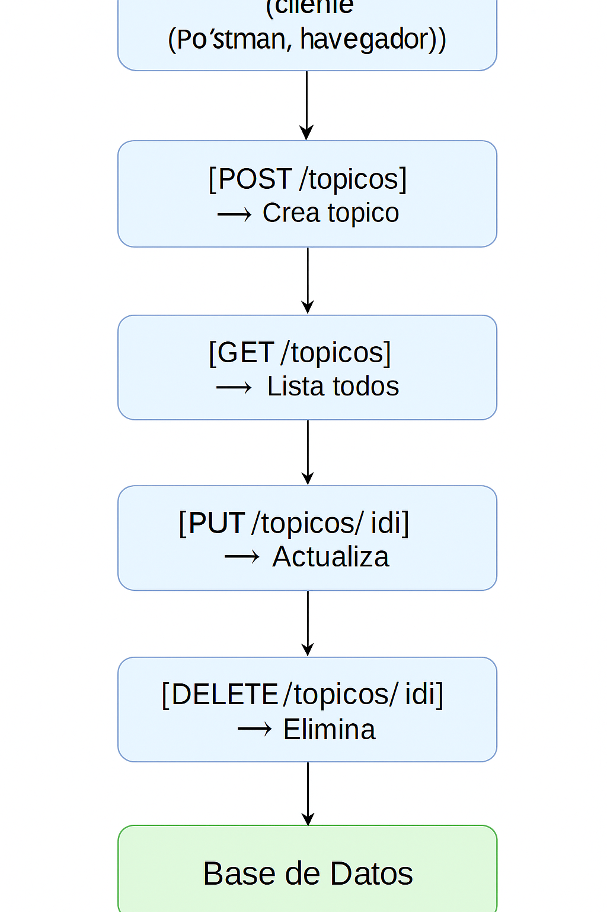

# 📚 Foro Hub - API REST para gestión de tópicos

Foro Hub es una API RESTful construida con Spring Boot que permite gestionar tópicos de discusión. Implementa operaciones CRUD completas, validaciones, persistencia en base de datos y autenticación/autorización.

---

## 🚀 Tecnologías utilizadas

- Java 21
- Spring Boot 3.x
- Spring Data JPA
- Spring Security
- MySQL / H2
- Maven
- Postman
- Git y GitHub

---

## 🧩 Funcionalidades

- ✅ Crear nuevos tópicos
- ✅ Listar todos los tópicos
- ✅ Filtrar tópicos por curso y año
- ✅ Obtener un tópico por ID
- ✅ Actualizar un tópico existente
- ✅ Eliminar un tópico
- ✅ Autenticación con token JWT
- ✅ Manejo de errores
- ✅ Validaciones con Bean Validation

---

## 🗺️ Diagrama del flujo de la API

Este diagrama muestra visualmente cómo se maneja el flujo de solicitudes dentro de la API:




> Asegúrate de tener la imagen en la misma carpeta que el `README.md` para que se vea correctamente en GitHub.

---

## ▶️ ¿Cómo ejecutar el proyecto?

1. Clona el repositorio:

   ```bash
   git clone https://github.com/Kenmar30/foro-hub.git
   cd foro-hub
   
2. Asegúrate de tener una base de datos configurada (H2 o MySQL).

3. Configura tu archivo application.properties según tu entorno.

4. Ejecuta la aplicación:


./mvnw spring-boot:run

5. Accede desde Postman o tu navegador:


http://localhost:8080/topicos


📫 Cómo contribuir
- Haz un fork de este repositorio.

- Crea una nueva rama: git checkout -b mi-feature

- Realiza tus cambios y haz commits: git commit -m "Agrega nueva feature"

- Haz push a tu rama: git push origin mi-feature

- Abre un Pull Request.

📝 Licencia
Este proyecto está bajo la licencia MIT.
Consulta el archivo LICENSE para más detalles.


---


